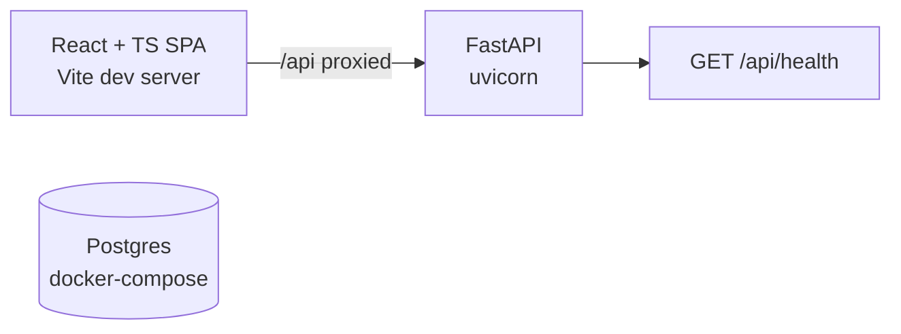

# Architecture

> Placeholder — filled in as features land.

## Current state (boilerplate)

- The frontend calls the backend exclusively through one axios instance with
  documented request/response interceptors
  ([frontend/src/api/client.ts](../frontend/src/api/client.ts)).
- The backend is a FastAPI app exposing `GET /api/health`
  ([backend/api/main.py](../backend/api/main.py)); response models translate
  snake_case Python to the camelCase wire contract in one base class
  ([backend/api/schemas.py](../backend/api/schemas.py)).
- Postgres runs in docker-compose; nothing consumes it yet.
