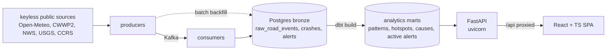

# Architecture

> Filled in as features land.

## Data plane

- **Ingestion** lands raw rows in the Postgres bronze layer over two idempotent
  paths (streaming producer -> Kafka -> consumer, and a batch backfill twin),
  plus a parallel near-real-time alert stream
  ([ADR-0006](adr/0006-data-plane.md), [ADR-0008](adr/0008-near-realtime-alerts.md)).
- **Transformation** is dbt: staging views over bronze, then the marts the API
  queries. Crashes key on a per-mile bin, weather on anchor towns
  ([ADR-0007](adr/0007-spatial-model-per-mile-bins.md)). See
  [warehouse.md](warehouse.md) for the mart lineage and grain.
- **The backend** is a FastAPI app; response models translate snake_case Python
  to the camelCase wire contract in one base class
  ([backend/api/schemas.py](../backend/api/schemas.py)). Journeys and forecasts
  are served from memory and Open-Meteo; crash history is the API's one
  Postgres read, composed from the marts per journey
  ([ADR-0010](adr/0010-crash-history-at-journey-grain.md)).
- **The frontend** calls the backend exclusively through one axios instance with
  documented request/response interceptors
  ([frontend/src/api/client.ts](../frontend/src/api/client.ts)).
