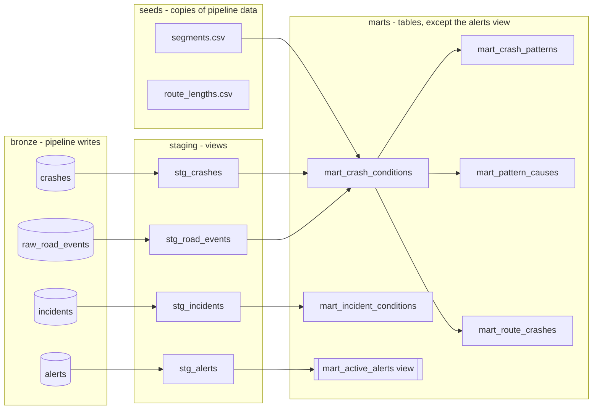

# Warehouse: the dbt marts

dbt turns the raw bronze tables the pipeline lands in Postgres into the
query-shaped marts the FastAPI backend serves. Why dbt (and not hand-written
SQL, or Spark) is [ADR-0006](adr/0006-data-plane.md); the per-mile spatial
grain is [ADR-0007](adr/0007-spatial-model-per-mile-bins.md); the alert stream
is [ADR-0008](adr/0008-near-realtime-alerts.md). How to run dbt is
[warehouse/README.md](../warehouse/README.md).

## Lineage

## Grain, in one table

| Mart | Grain | What it answers | Materialized |
|---|---|---|---|
| `mart_crash_conditions` | one row per crash | the regime each crash happened in (sensor within 2 h, else report) | table |
| `mart_crash_patterns` | route x mile bin x regime | how many crashes, how many fatal, over what dates | table |
| `mart_pattern_causes` | route x mile bin x regime x rank | the top three recorded causes | table |
| `mart_route_crashes` | one row per crash | the crash points the map plots | table |
| `mart_incident_conditions` | one row per live collision | live CHP collisions with the weather they were collected in (**provisional**, ADR-0012) | table |
| `mart_active_alerts` | one row per recent alert | the near-real-time chain-control / incident feed | **view** |

`GET /api/crash-patterns` reads three of these per request: bins from
`mart_crash_patterns` (rank-1 cause joined from `mart_pattern_causes`) and
journey-level top causes grouped over `mart_crash_conditions`. Why the API
composes at request time instead of a journey-grain mart is
[ADR-0010](adr/0010-crash-history-at-journey-grain.md). `mart_active_alerts`
is consumed by the alerts branch. (An earlier `mart_hotspots` — route-relative
crash concentration — was removed once the map's density marks covered the
product need; nothing served it.)

`mart_incident_conditions` is the **provisional** companion to the CCRS marts
(ADR-0012): live CHP collisions the poll worker collected, each paired with the
weather at its point, deduped to one row per collision. It is deliberately kept
apart from the authoritative history: CHP is unofficial and thin (no severity,
injury, or cause), so it never feeds `mart_crash_patterns`. `GET /api/incidents`
serves it, always labelled provisional so the UI can never present it as the
verified record.

## Two spatial grains, on purpose (ADR-0007)

Crashes carry their own lat/lon, so they get a fine position: the **per-mile
bin**, `floor(measure_mi)`, is the grain the aggregate marts key on. Weather is
only sampled at **anchor towns** (the public feeds are point queries), so the
sensor-regime join happens at anchor grain inside `mart_crash_conditions` and
then rides along on each crash. A crash with no measure (a single-town spur
route, or a point off the polyline) has a null bin: it stays in
`mart_route_crashes` (it still has a real point to plot) but drops out of the
per-mile marts, so a per-mile query answers honestly empty rather than
inventing a location.

## Why `mart_active_alerts` is a view

Every other mart is a batch table rebuilt on the pipeline's schedule. The alert
stream runs on a ~60-second clock, so a table would only ever be as fresh as
the last `dbt run`. A view reads bronze at query time, so its `now() - interval
'24 hour'` window is evaluated per request and the feed stays live between dbt
runs. It is the one place the batch warehouse yields to the real-time path.

## Tests as data contracts

`dbt build` runs the tests inline with the models. Alongside the column tests
(`not_null`, `unique`, `accepted_values` on the regime and cause vocabularies),
two singular tests
([warehouse/tests/](../warehouse/tests/)) assert each aggregate mart holds
exactly one row per its grain.

>  A single-column test cannot catch a broken *composite* grain. If a join in `mart_crash_conditions` ever fanned out
> (say the nearest-anchor attribution matched a crash to two anchors, or a
> sensor-reading join returned more than one row), that crash would appear twice
> and every count built on top of it would be inflated: `crash_count` in
> `mart_crash_patterns`, and through it every total and cause share the API
> serves. The singular test (`group by <grain> having count(*) > 1`)
> is the thing that fails the build the moment a crash is double counted.

### Inputs and environment are tested too

A dbt test can only trust the rows it is given, so two tests guard the edges of
the warehouse:

- **Seeds cannot silently drift.** The two seeds are copies of pipeline data
  (`segments.csv` from `pipeline.routes.build_segments`, `route_lengths.csv`
  from `shared/route-polylines.json`). A pipeline test,
  [pipeline/tests/test_warehouse_seeds.py](../pipeline/tests/test_warehouse_seeds.py),
  re-derives both from source and asserts the CSVs still match, so editing the
  route catalogue without re-exporting the seed fails `pytest` rather than
  building the marts on stale geography.
- **The whole chain runs against a real Postgres.** The `warehouse` job in
  [ci.yml](../.github/workflows/ci.yml) stands up `postgres:17`, applies the
  bronze schema and a small fixture, then runs `dbt build` (seed + run + test)
  on every push. Postgres-specific behavior (the `~` regex, `filter (where ...)`,
  interval math) is exercised for real, so green CI should mean the marts genuinely
  build and every contract holds on the same engine production uses.
