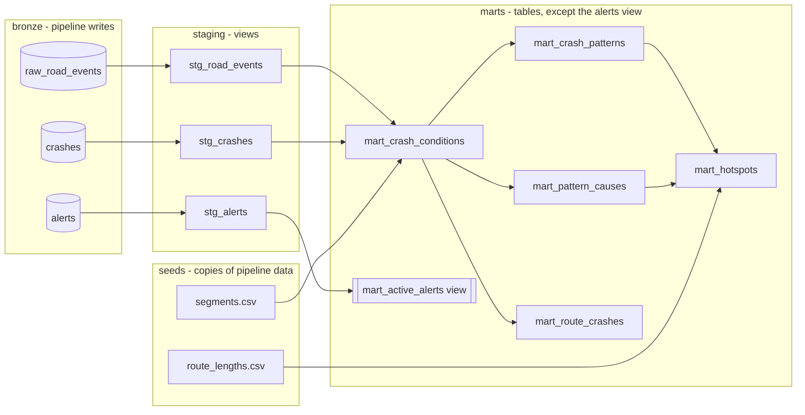

# Warehouse: the dbt marts

dbt turns the raw bronze tables the pipeline lands in Postgres into the
query-shaped marts the FastAPI backend serves. Why dbt (and not hand-written
SQL, or Spark) is [ADR-0006](adr/0006-data-plane.md); the per-mile spatial
grain is [ADR-0007](adr/0007-spatial-model-per-mile-bins.md); the alert stream
is [ADR-0008](adr/0008-near-realtime-alerts.md). How to run dbt is
[warehouse/README.md](../warehouse/README.md).

## Lineage

## Grain, in one table

| Mart | Grain | What it answers | Materialized |
|---|---|---|---|
| `mart_crash_conditions` | one row per crash | the regime each crash happened in (sensor within 2 h, else report) | table |
| `mart_crash_patterns` | route x mile bin x regime | how many crashes, how many fatal, over what dates | table |
| `mart_pattern_causes` | route x mile bin x regime x rank | the top three recorded causes | table |
| `mart_hotspots` | route x mile bin x regime | where crashes concentrate vs the route's per-mile average | table |
| `mart_route_crashes` | one row per crash | the crash points the map plots | table |
| `mart_active_alerts` | one row per recent alert | the near-real-time chain-control / incident feed | **view** |

## Two spatial grains, on purpose (ADR-0007)

Crashes carry their own lat/lon, so they get a fine position: the **per-mile
bin**, `floor(measure_mi)`, is the grain the aggregate marts key on. Weather is
only sampled at **anchor towns** (the public feeds are point queries), so the
sensor-regime join happens at anchor grain inside `mart_crash_conditions` and
then rides along on each crash. A crash with no measure (a single-town spur
route, or a point off the polyline) has a null bin: it stays in
`mart_route_crashes` (it still has a real point to plot) but drops out of the
per-mile marts, so a per-mile query answers honestly empty rather than
inventing a location.

## Why the hotspot denominator is a length, not a row count

`concentration_ratio = bin crashes / (route crashes in that regime / route
length in miles)`. Using the whole route length (the `route_lengths` seed)
means an empty stretch of road correctly dilutes the average, so a genuinely
busy mile stands out. That is why no zero-crash grid is materialized: the
denominator is a number from a seed, not a count of rows we would otherwise
have to invent. A bin flags as a hotspot at ratio >= 1.5 **and** >= 8 crashes;
below 8 it is treated as noise and the UI keeps showing the small-sample
caveat.

## Why `mart_active_alerts` is a view

Every other mart is a batch table rebuilt on the pipeline's schedule. The alert
stream runs on a ~60-second clock, so a table would only ever be as fresh as
the last `dbt run`. A view reads bronze at query time, so its `now() - interval
'24 hour'` window is evaluated per request and the feed stays live between dbt
runs. It is the one place the batch warehouse yields to the real-time path.

## Tests as data contracts

`dbt build` runs the tests inline with the models. Alongside the column tests
(`not_null`, `unique`, `accepted_values` on the regime and cause vocabularies),
three singular tests
([warehouse/tests/](../warehouse/tests/)) assert each aggregate mart holds
exactly one row per its grain. A pipeline test
(`pipeline/tests/test_warehouse_seeds.py`) asserts the two seeds still match the
code and geometry they were exported from, so a seed cannot silently drift. CI
runs the whole chain against a real Postgres (the `warehouse` job in
[ci.yml](../.github/workflows/ci.yml)).
